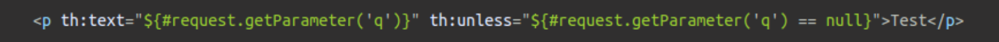

Starting up with Spring MVC

For gradle, generate a new project at https://start.spring.io/
spring-boot-devtools allows viewing changes to the project in real time without the need for resetting. Similar it seems to nodemon with Java/NodeJS https://docs.spring.io/spring-boot/docs/current/reference/htmlsingle/#using-boot-devtools

```JAVA
package com.example.servingwebcontent;

import org.springframework.boot.SpringApplication;
import org.springframework.boot.autoconfigure.SpringBootApplication;

@SpringBootApplication
public class ServingWebContentApplication {

    public static void main(String[] args) {
        SpringApplication.run(ServingWebContentApplication.class, args);
    }

}
```

`@SpringBootApplication` adds

- `@Configuration`
- `@EnableAutoConfiguration`
- `@ComponentScan`

The `SpringApplication.run()` method within `main()` launches the application.

Run the application with the console command `./gradlew bootRun` or just build the file with `./gradlew build` and run the file with `java -jar build/libs/gs-serving-web-content-0.1.0.jar`

HTML, CSS and JS can all be added to the Spring Boot application by plopping them into the proper place in the source code, usually `/static` or `/public`

Spring MVC calls the data accesed during execition of views `model attributes` and you add them to a view using the `addAttribute` method.

```java
    @RequestMapping(value = "message", method = RequestMethod.GET)
        public String messages(Model model) {
            model.addAttribute("messages", messageRepository.findAll()); // <- right in here
            return "message/list";
        }
```


# Spring MVC and Thymeleaf


The Spring Web MVC framework provides Model-View-Controller (MVC) architecture and ready components that can be used to develop flexible and loosely coupled web applications. The MVC pattern results in separating the different aspects of the application (input logic, business logic, and UI logic), while providing a loose coupling between these elements.


In a typical Spring MVC application, `@Controller` classes are responsible for preparing a model 
map with data and selecting a view to be renered. This model map allows for the complete 
abstraction of the view technology and, in the case of Thymeleaf, it is transformed in to a 
Thymeleaf context object that makes all the defined variables available to expressions executed 
in templates.

Spring MVC calls the piece of data that can be accessed during the execution of views model 
attributes commonly referred to in Thymeleaf language as *context variables*.

There are several ways of adding model attributes to a view in Spring MVC:

1. Add attribute to `Model` via its `addAttribute` method.
2. Return `ModelAndView` with model attributes included.
2. Expose common attributes via methods annotated with `@ModelAttribute`

To access url parameters, there are also several methods.

1. Use the `param.` prefix.


2. Since parameters can be multivalued (e.g. `https://example.com/query?q=Thymeleaf%20Is%20Great!
   &q=Really%3F`) you may access them using brackets syntax 


3. by using the special `#request` object that gives you direct access to the `javax.servlet.http.
   HttpServletRequest` object  




## Source
[Rafat Borowiec](https://www.thymeleaf.org/doc/articles/springmvcaccessdata.html)