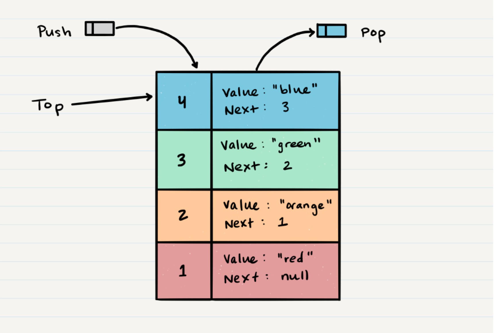
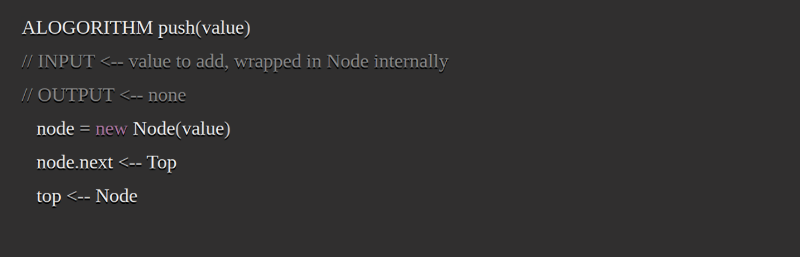
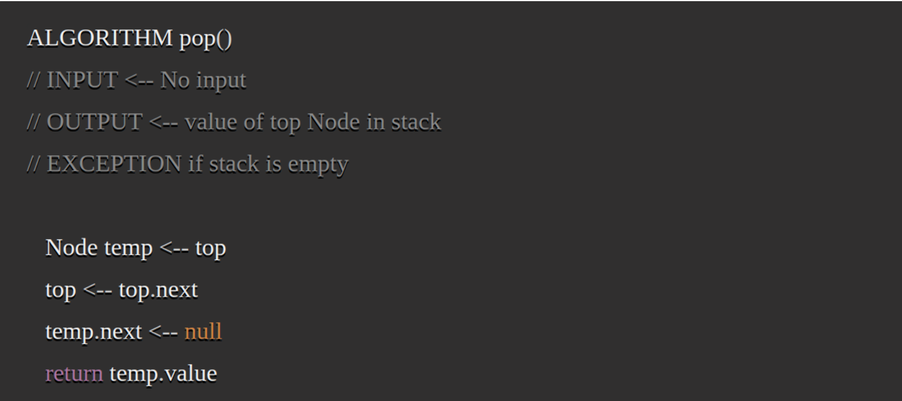
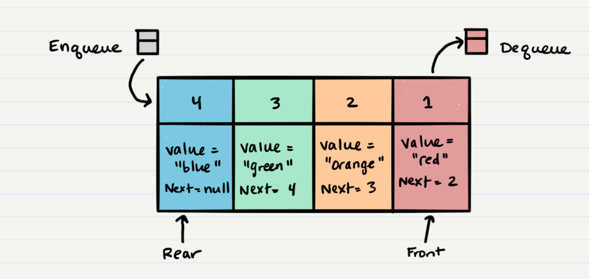
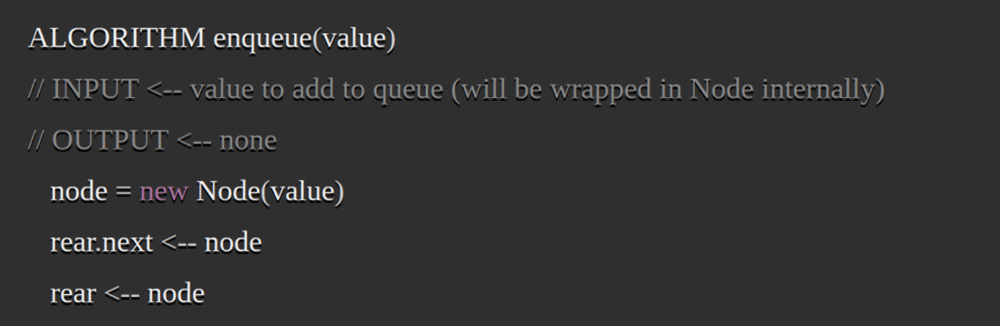
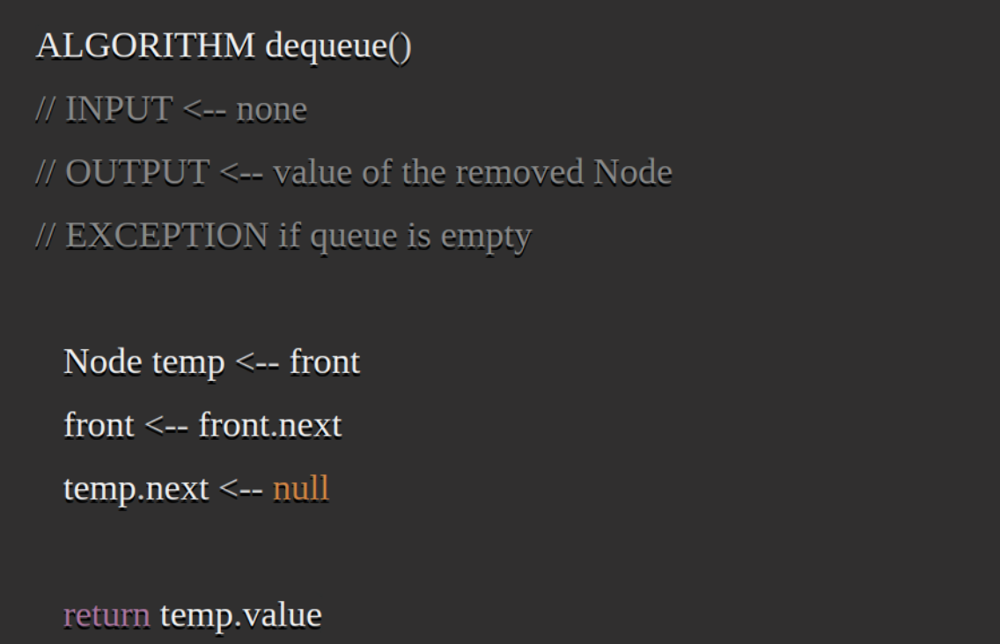

# Stacks

[Home](../Readme.md)

A stack is a data strucure that consists of `Nodes`. Each `Node` references the next Node in the 
stack, but does not reference its previous. 

Common terms:

- `Push` - Nodes or items that are put into the stack are pushed
- `Pop` - Nodes removed from the stack are popped. When you attempt to `pop` an empty stack an 
  exception will be raised.
- `Top` - This is the top of the stac
- `Peek` - When you `peek` you will view the value of the `top` Node in the stack. When you 
  attempt to `peek` an empty stack, an exception will be raised.
- `isEmpty` - a boolean value used to determine if a stack is empty

Stacks follow these concepts:

**F**irst **I**n **L**ast **O**ut
The first item added in the stack will be the last item popped out of the stack.

**L**ast **I**in **F**irst **O**ut
The last item added to the stack will be the first item popped out of the stack.

Pushing a Node onto a stack will always be an O(1) operation because it takes the same amount of 
time no matter how many Nodes are in the stack.

When adding a Node, you `push` it into the stack by assigning it as the new top, with its `next` 
property equal to the original `top`

Popping a Node off a stack is the action of removing a Node from the top. When conducting a 
`pop`, the `top` Node will be re-assigned to the Node that lives below and the `top` Node is 
returned to the user. Typically, you would check `isEmpty` before conducting a `pop`. This will 
ensure that an exception is not raised. Alternately, you can wrap the call in a try/catch block.

# Queue

Unlike stacks, Queues are **F**irst **I**n **F**irst **O**ut. The last item in the queue will be 
the last item out of the queue.

`Enqueue` - Nodes or items that are added to the queue.

`Dequeue` - Nodes or items that are removed from the queue. If called when the queue is empty an exception will be raised.

`Front` - This is the front/first Node of the queue.

`Rear` - This is the rear/last Node of the queue.

`Peek` - When you peek you will view the value of the front Node in the queue. If called when the queue is empty an exception will be raised.

`IsEmpty` - returns true when queue is empty otherwise returns false. 