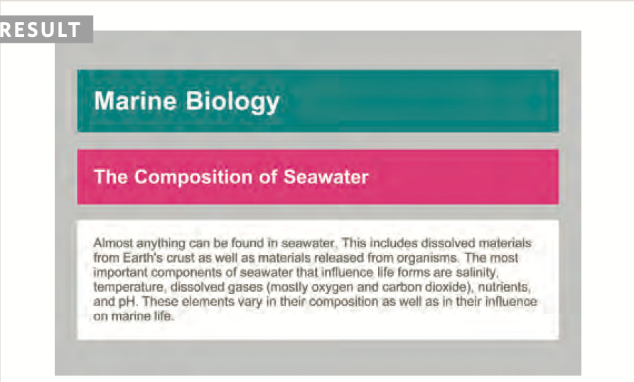
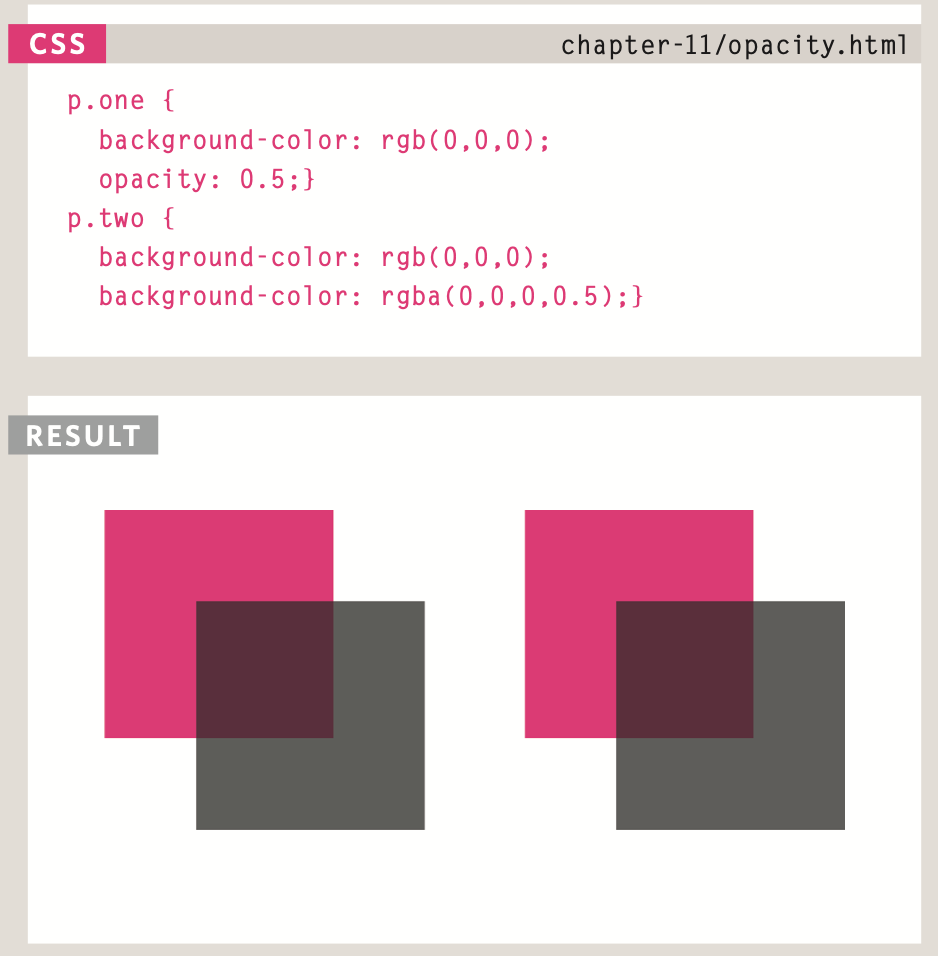

# Foreground Color:

## color:

The color property allows you to specify the color of text inside an element. You can specify any color in CSS in one of three ways:
1. rgb values.
1. hex Codes.
1. Color names.

/* color name */

h1 {
  color: DarkCyan;}

/* hex code */

h2 {color: #ee3e80;}

/* rgb value */

p{color: rgb(100,100,90);}

# background Colre:

body {
  background-color: rgb(200,200,200);}

h1 {
  background-color: DarkCyan;}

h2 {
  background-color: #ee3e80;}

p{
background-color: white;}

*CSS treats each HTML element as if it appears in a box, and the background-color property sets the color of the background for that box.*

*You can specify your choice of background color in the same three ways you can specify foreground colors: RGB values, hex codes, and color names (covered on the next page).*

 # understanding Color:

 Every color on a computer screen is created by mixing amounts of red, green, and blue. To find the color you want, you can use a color picker.
 
 1. RGB 
 1. HEX
 1. ColoR Names
 1. Hue
 1. satuRatioN
 1. BRiGHtNess

 # Contrast:
 * low
 * high
 * medium

## Css3: opacity:

## hsl & hsla:
The hsl color property has
been introduced in CSS3 as an alternative way to specify colors. The value of the property starts with the letters hsl, followed
by individual values inside parentheses for:
1. hue
1. saturation
1. lightness
1. alpha

