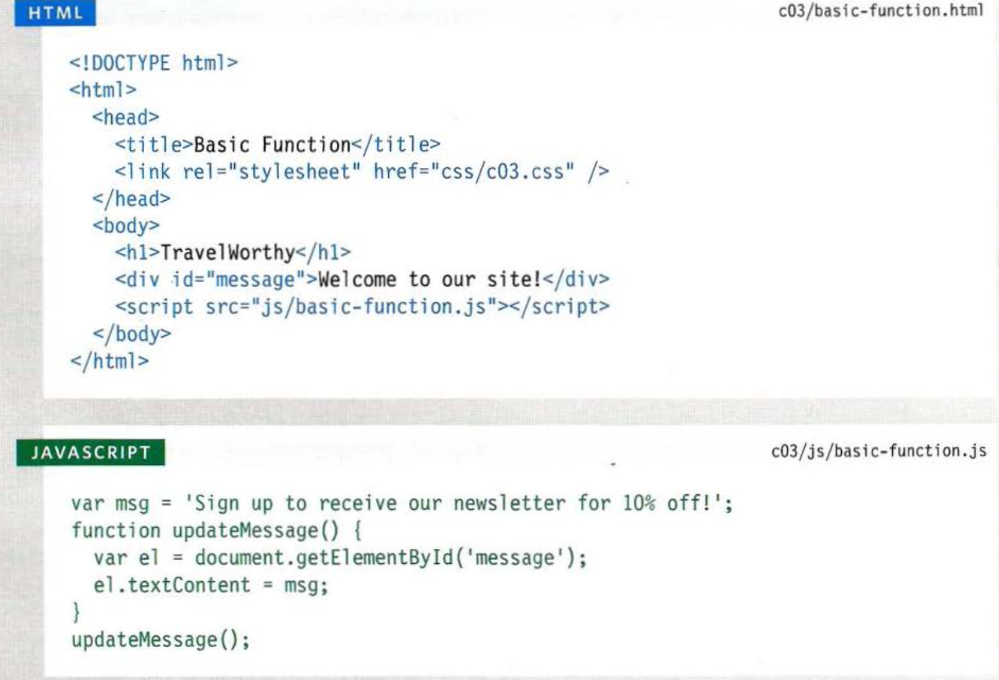
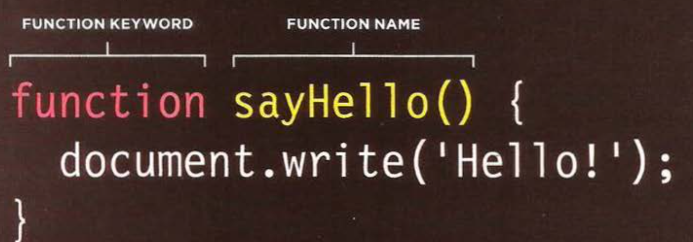
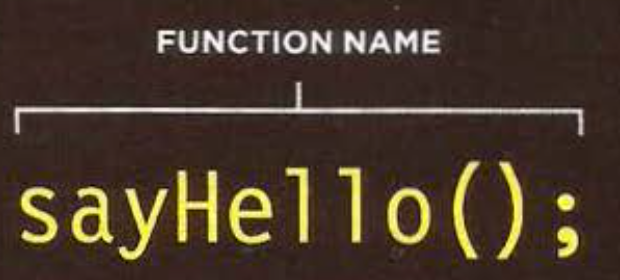
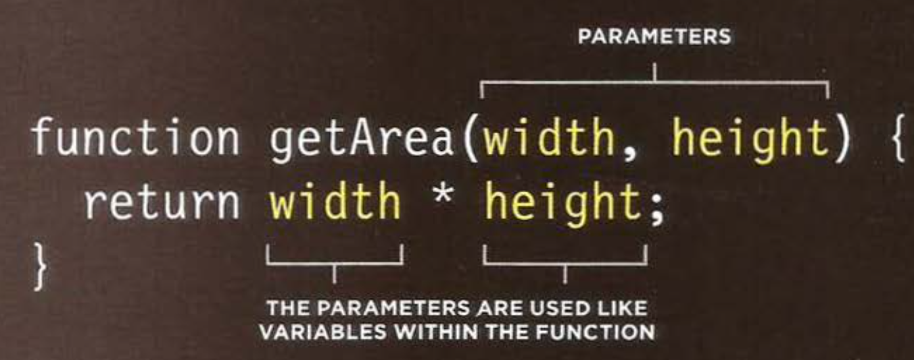
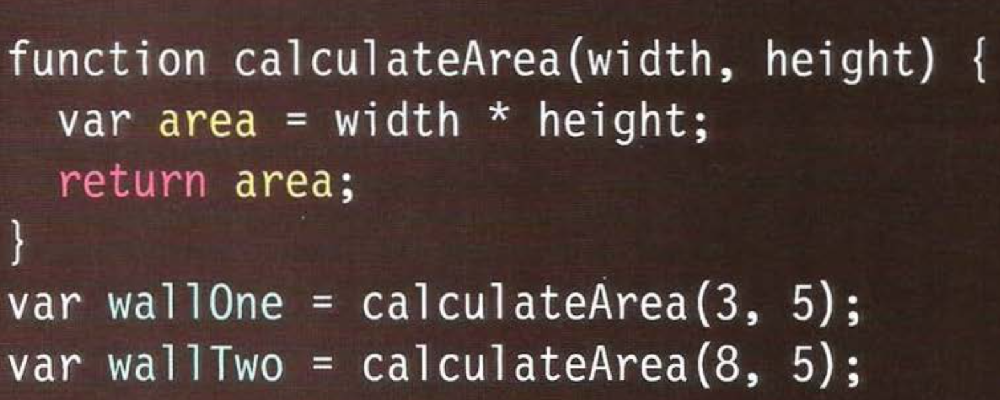

 # WHAT IS A FUNCTION?
 
  WHAT IS A FUNCTION?
Functions let you group a series of statements together to perform a specific task. If different parts of a script repeat the same task, you can reuse the function (rather than repeating the same set of statements). 

* Grouping together the statements that are required to answer a question or perform a task helps organize your code.

* Furthermore, the statements in a function are not always executed whenapageloads,sofunctions also offer a way to store the steps needed to achieve a task. The script can then ask the function to perform all of those steps as and when they are required.

* If you are going to ask the function to perform its task later, you need to give your function a name. That name should describe the task it is performing. When you ask it to perform its task, it is known as calling the function.

* Some functions need to be provided with information in order to achieve a given task. For example, a function to calculate the area of a box would need
to know its width and height. 

* When you write a function and you expect it to provide you with an answer, the response is known as a return value.

# BASIC FUNCTION

 In this example, the user is shown a message at the top of the page. The message is held
in an HTML element whose id attribute has a value of message. The message is going to be changed using JavaScript.

# declaring a function:

# calling afunction:

# DECLARING FUNCTIONS THAT NEED INFORMATION:
Sometimes a function needs specific information to perform its task. In such cases, when you declare the function you give it parameters. Inside the function, the parameters act like variables.

# CALLING FUNCTIONS THAT NEED INFORMATION:

When you call a function that has parameters, you specify the values it should use in the parentheses that follow its name. The values are called arguments, and they can be provided as values or as variables.

# GETTING A SINGLE VALUE OUT OF A FUNCTION:

Some functions return information to the code that called them. For example, when they perform a calculation, they return the result.

