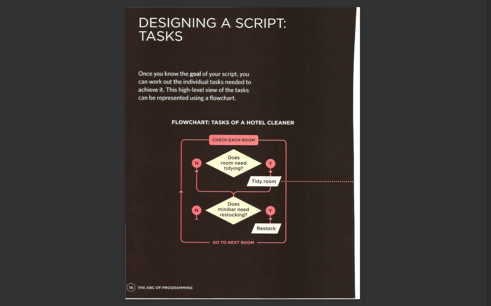
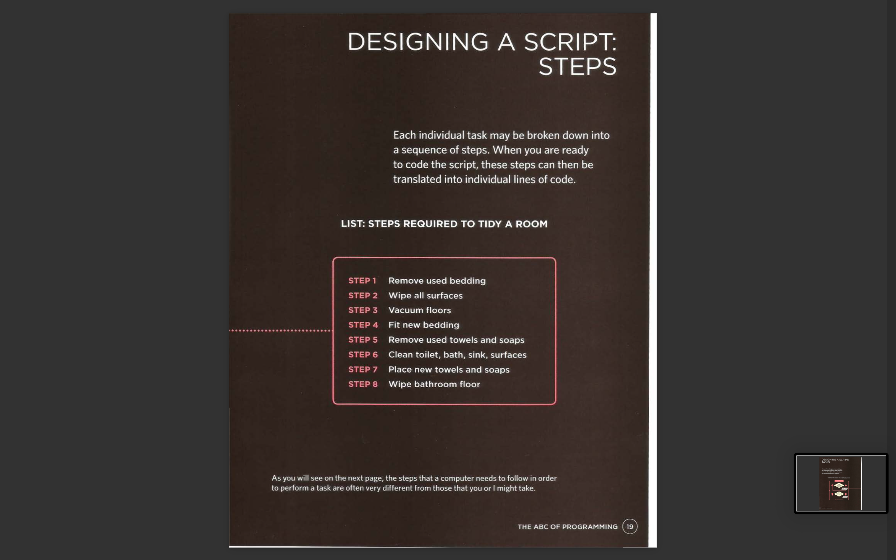
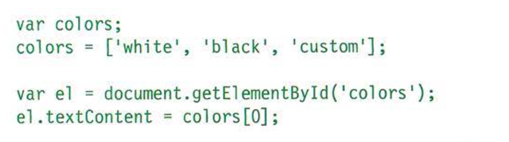
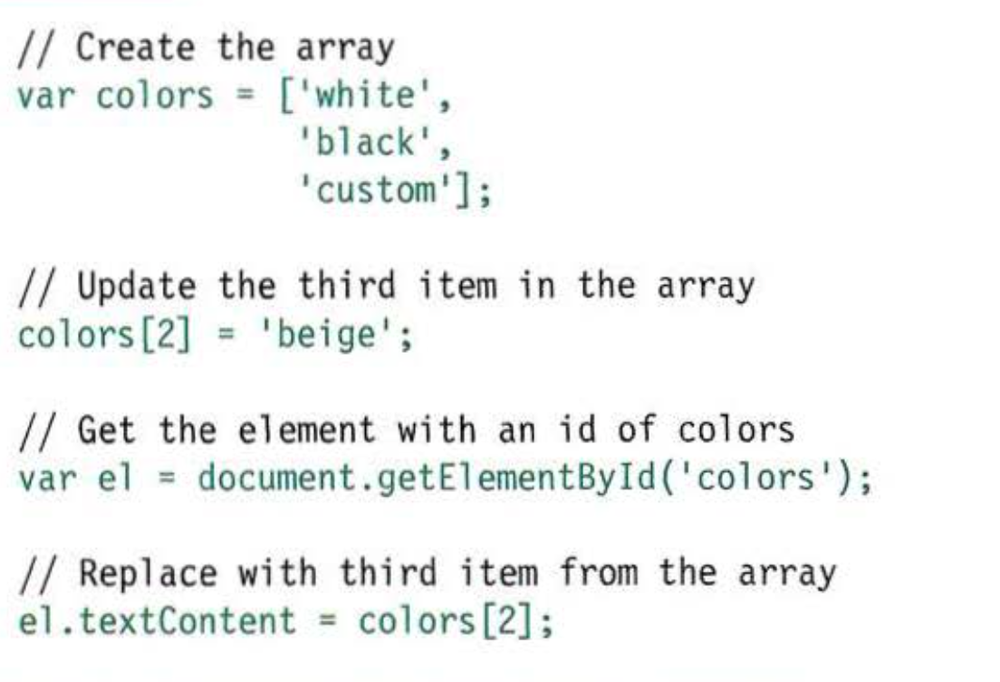

# Welcome

## This website explains how JavaScript can be used in browsers to make websites more interactive, interesting, and user-friendly.

**How javascript makes webpages more interactive:**
* access content: (you can use javascript to select any elemant an html page)
* modify content: (you can use javascript to add elemant an html page)
* program rules: (you can specify aset of stebs for the browser to follow)
* react to events

 EXAMPLES OF JAVASCRIPT IN THE BROWSER:

 
  

  # WHAT IS A SCRIPT??
  A script is a series of instructions that a computer can follow to achieve a goal.

****

 # RULES FOR NAMING VARIABLES:
 1. The name must begin with a letter, dollar sign ($),or an underscore (_). It must not start with a number.

 2. The name can contain letters, numbers, dollar sign ($), or an underscore (_). Note that you must not use a dash(-) or a period (.) in a variable name.
 
  3. You cannot use keywords or reserved words.

  4. All variables are case sensitive, so score and Score would be different variable names, but
it is bad practice to create two variables that have the same name using different cases.

5. Use a name that describes the kind of information that the variable stores. For example, fi rstName might be used to store a person's first name,
l astNarne for their last name, and age for their age.

6. If your variable name is made
up of more than one word, use a capital letter for the first letter of every word after the first word.

 # *ARRAYS:*

 An array is a special type of variable. It doesn't just store one value; it stores a list of values. 

 * You should consider using an array whenever you are working with a list or a set of values that are related to each other.

 ## CREATING AN ARRAY:

 

 Values in an array are accessed as if they are in a numbered list. It is important to know that the numbering of this list starts at zero.

## ACCESSING &CHANGING VALUES IN AN ARRAY:
 

* The first lines of code on the left create an array containing a list of three colors. (The values can be added on the same line or on separate lines as shown here.)

* Having created the array, the third item on the list is changed from 'custom' to 'beige'.

* To access a value from an array, after the array name you specify the index number for that value inside square brackets.

* You can change the value of an item an array by selecting it and assigning it a new value just as you would any other variable (using the equals sign and the new value for that item).

* In the last two statements, the newly updated third item in the array is added to the page.

