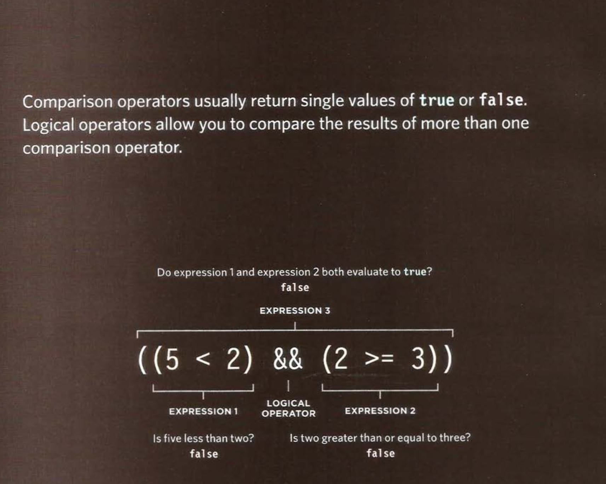
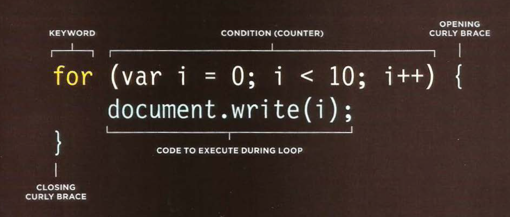

# Comparison and logical operators: 

You can evaluate a situation by comparing one value in the script to what you expect it might be. The result will be a Boolean: true or false.

* is equal to (==).
* isnot equal to (!=)
* strict (===).
* stric not equal (!==).
* greater than (>).
* less than (<).
* greater than or equel (>=).
* less than or equel (<=).
 

 ## structuring compareson operators:

 *In any condition, there is usually one operator and two operands. The operands are placed on each side of the operator. They can be values or variables. You often see expressions enclosed in brackets.*

 

 # logical operator:

 1. and(&&) .
 1. or(||) .
 1. not(!) .

 

 # loops:

### Loops check a condition. If it returns true, a code block will run. Then the condition will be checked again and if it still returns true, the code block will run again. It repeats until the condition returns false. There are three common types of loops but in this section we talked about just two:
1. for loop:

1. while loop:

