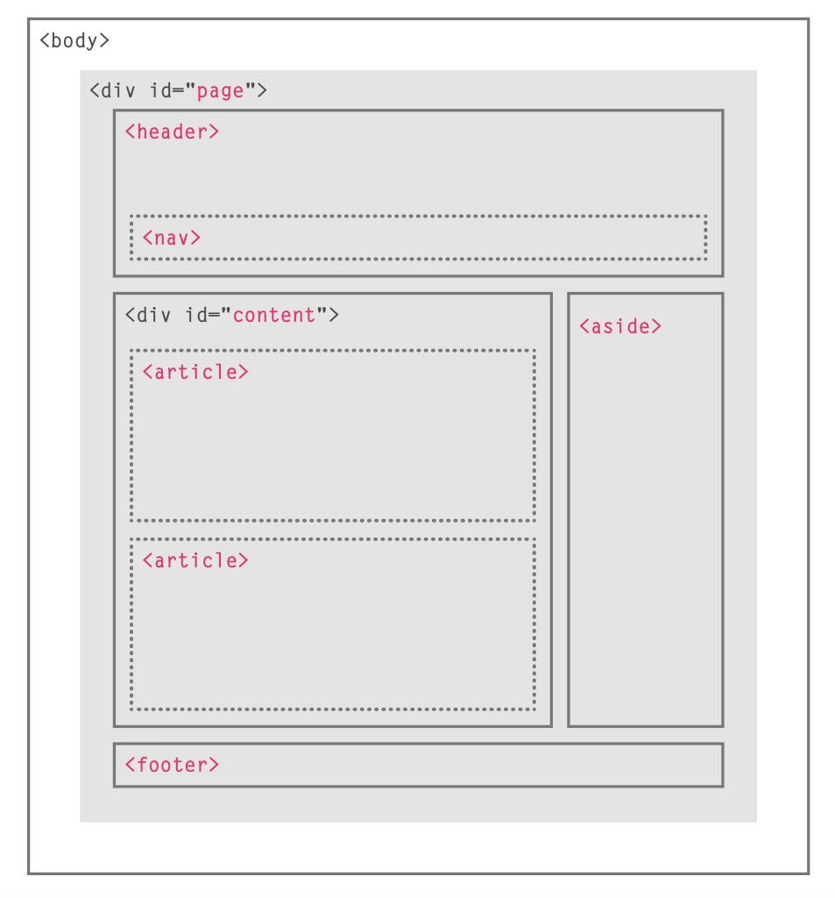
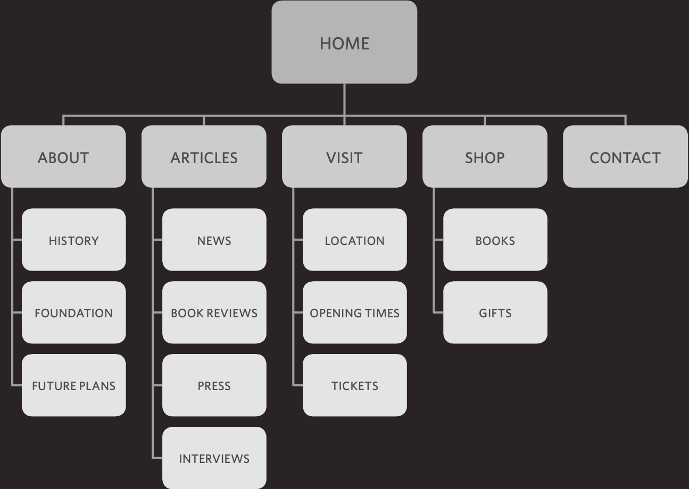

# Many websites  that teach HTML and CSS resemble dull manuals. To make it easier for you to learn

## the structure of thIs website :

## 1: html 

We will spend the first chapter looking at how HTML is used to create web pages. You will see that you start by writing down the words you want to appear on your page. You then add tags or elements to the words so that the browser knows what is a heading, where a paragraph begins and ends, and so on. 

We come across all kinds of documents every day of our lives. Newspapers, insurance forms, shop catalogues... the list goes on. 

### In first we talking about heading :

The use of headings and subheadings in any document often reflects a hierarchy of information. For example, a document might start with 
a large heading, followed by an introduction or the most important information. 

HtmL deScribe tHe Structure of Page :
 ``` <html>
  <body>
<h1>This is the Main Heading</h1>
<p>This text might be an introduction to the rest of 
       the page. And if the page is a long one it might
be split up into several sub-headings.<p> 
<h2>This is a Sub-Heading</h2>
<p>Many long articles have sub-headings so to help 
you follow the structure of what is being written. There may even be sub-sub-headings (or lower-level headings).</p> 
<h2>Another Sub-Heading</h2> 
<p>Here you can see another sub-heading.</p> </body> 
</html> 
```

Here we talked about tags:


Tags act like containers. They tell you something about the information that lies between their opening and closing tags. 


```
<p> paragraph </p> 
```

### comment in html:
```
<!-- --> 

<!-- start of introduction --><h1>Current Exhibitions</h1><h2>Olafur Eliasson</h2><!-- end of introduction -->

```


### group in html

There are two types :
#### Unordered list.
```
<ul> 
<li>Science: 21 Nov - 20 Feb 2010/11</li>
 <li>Architecture: 6 Mar - 15 May 2011</li>
 <li>History: 29 May - 21 Aug 2011</li> 
<li>Religion: 28 Aug - 6 Nov 2011</li> 
</ul> 
```


#### Ordar list:
```
<ol> 
<li>Science: 21 Nov - 20 Feb 2010/11</li>
 <li>Architecture: 6 Mar - 15 May 2011</li>
 <li>History: 29 May - 21 Aug 2011</li> 
<li>Religion: 28 Aug - 6 Nov 2011</li> 
</ol> 
```


### Iframes:

An iframe is like a little window that has been cut into yourpage — and in that window you can see another page. The term iframe is an abbreviation of inline frame
```
<iframe> :
<iframe
  width="450"
  height="350"
  src="http://maps.google.co.uk/maps?q=moma+new+york
  &amp;output=embed">
</iframe> 
```
### src 

The src attribute specifies the URL of the page to show in the frame. 

### height 

The height attribute specifies the height of the iframe in pixels. 

### width 

The width attribute specifies the width of the iframe in pixels. 

### scrolling 

The scrolling attribute willnot be supported in HTML5. In HTML 4 and XHTML, it indicates whether the iframe shouldhave scrollbars or not. This is important if the page inside the iframe is larger than the space you have allowed for it (using the height and width attributes). Scrollbars allow the user to move around the frame to see more content. It can take one of three values: yes (to show scrollbars), no (to hide scrollbars) and auto (to show them only if needed). 
```
<iframe>
  src="http://maps.google.co.uk/maps"
  width="450"
  height="350"
  frameborder="0"
  scrolling="no">
</iframe> 
```


## 2: css 


We start this section with a chapter that explains how CSS uses rules to enable you to control the styling and layout of web pages. We then go on to look at the wide variety of CSS properties you can use in your CSS rules.

CSS allows you to create rules that control the way that each individual box (and the contents of that box) is presented.


## The key to understanding how CSS works is to imagine that there is an invisible box around every HTML element.

# example Styles in css:

* ## Boxes
1. width
1. height
1. border
* ## Texts
1. Typeface
1. Size
1. Color
* ## Specific
There are also specific ways in which you can style certain element
<br/>
<br/>
<br/>

# this is example in css format:
front
```
body {
  font-family: Arial, Verdana, sans-serif;}
  ```
color
  ```
h2 {
  color: #ee3e80;}
p{
color: #665544;}
```


# `Traditional HTML Layout:`

HTML5 introduces a new set of elements that allow you to divide up the parts of a page. The names of these elements indicate the kind of content you will find in them.

The layout in html5 and main thing in html is:

1. footer
1. strong
1. nav
1. main
1. artical
1. header

### in the picture ther is an explanation for that.




last thing we talked about in this sheets its **site maps:**

Now that you know what needs to appear on your site, you can start to organize the information into sections or pages.


## `Example site map:`




## `Example WireFrames:`


# Foreground Color:

## color:

The color property allows you to specify the color of text inside an element. You can specify any color in CSS in one of three ways:
1. rgb values.
1. hex Codes.
1. Color names.

/* color name */

h1 {
  color: DarkCyan;}

/* hex code */

h2 {color: #ee3e80;}

/* rgb value */

p{color: rgb(100,100,90);}

# background Colre:

body {
  background-color: rgb(200,200,200);}

h1 {
  background-color: DarkCyan;}

h2 {
  background-color: #ee3e80;}

p{
background-color: white;}


*CSS treats each HTML element as if it appears in a box, and the background-color property sets the color of the background for that box.*

*You can specify your choice of background color in the same three ways you can specify foreground colors: RGB values, hex codes, and color names (covered on the next page).*


 # understanding Color:

 Every color on a computer screen is created by mixing amounts of red, green, and blue. To find the color you want, you can use a color picker.
 
 1. RGB 
 1. HEX
 1. ColoR Names
 1. Hue
 1. satuRatioN
 1. BRiGHtNess

 # Contrast:
 * low
 * high
 * medium

## Css3: opacity:


## hsl & hsla:
The hsl color property has
been introduced in CSS3 as an alternative way to specify colors. The value of the property starts with the letters hsl, followed
by individual values inside parentheses for:
1. hue
1. saturation
1. lightness
1. alpha


