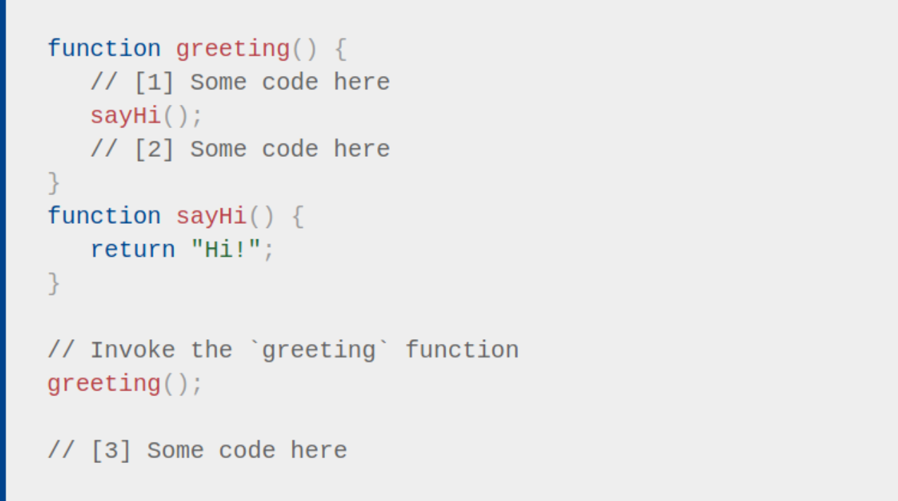

# The Call Stack
[Home](../README.md)

A **call stack** is a mechanism for an interpreter to keep track of its place in a script that calls multiple functions - what function is currently being run and what functions are called from within that function.

- When a script calls a function, the interpreter adds it to the call stack and then starts carrying out the function.
- Any functions that are called by that function are added to the call stack further up, and run where their calls are reached
- When the current function is finished, the interpreter takes it off the stack and resumes execution where it left off in the last code listing.
- If the stack takes up more space than it had assigned to it, it results in a "stack overflow" error.

The above code would execute like this:
1. Ignore all functions, until it reaches the `greeting()` function invocation.
2. Add the `greeting()` function to the call stack list.
3. Execute all lines of code inside the `greeting()` function.
4. Get to the sayHi() function invocation.
5. Add the sayHi() function to the call stack list.
6. Execute all lines of code inside the `sayHi()` function, until reaches end.
7. Return execution to the line that invoked `sayHi()`and continue executing the rest of the `greeting()` function
8. Delete the `sayHi()` function from our call stack list.
9. When everything inside the `greeting()` function has been executed, return to its invoking line to continue executing the rest of the JS code.
10. Delete the `greeting()` function from the call stack list.

Source:
[MDN](https://developer.mozilla.org/en-US/docs/Glossary/Call_stack)