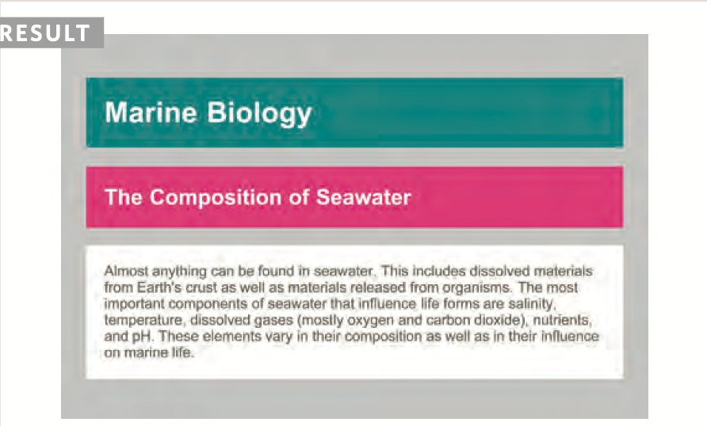

# welcome to learn web dev:
## first we talked about html:

1. Headings:

```
<h1> <h2> <h3> <h4> <h5> <h6>
```
 HTML has six "levels" of headings:
 ```

<h1> 
is used for main headings

 <h2>
  is used for subheadings
If there are further sections under the subheadings then the <h3> element is used, and so on...
```
2. Paragraphs:

```
<p>
To create a paragraph, surround the words that make up the paragraph with an opening <p> tag and closing </p> tag.
```


3. Bold & italic:
```
<b>
By enclosing words in the tags <b> and </b> we can make characters appear bold.

<i>
By enclosing words in the tags <i> and </i> we can make characters appear italic.

```

4. superscribt&subscript:
```
<sup>
The <sup> element is used
to contain characters that should be superscript such
as the suffixes of dates or mathematical concepts like raising a number to a power such as 22.

<sub>
The <sub> element is used to contain characters that should be subscript. It is commonly used with foot notes or chemical formulas such as H20.
```


5. line Braek & Horizontal rules:
```
<br/>
As you have already seen, the browser will automatically show each new paragraph or heading on a new line. But if you wanted to add a line break inside the middle of a paragraph you can use the line break tag <br />.

<hr />
To create a break between themes — such as a change of topic in a book or a new scene
in a play — you can add a horizontal rule between sections using the <hr /> tag.

```
# semantic markup:

There are some text elements that are not intended to affect the structure of your web pages, but they do add extra information to the pages — they are known as semantic markup.

```
In the rest of the chapter you will meet some more elements that will help you when you are adding text to web pages. For example, you are going to meet the <em> element that allows you to indicate where emphasis should be placed on selected words and the <blockquote> element which indicates that a block of text is a quotation.


Browsers often display the contents of these elements in
a different way. For example, the content of the <em> element is shown in italics,
and a <blockquote> is usually indented. But you should not use them to change the way that your text looks; their purpose is to describe the content of your web pages more accurately.


The reason for using these elements is that other programs, such as screen readers or search engines, can use this extra information. For example, the voice of a screen reader may add emphasis to the words inside the <em> element, or a search engine might register that your page features a quote if you use the <blockquote> element.
```
6. strong & emphasis:
```
<strong>
The use of the <strong> element indicates that its content has strong importance.

<em>

The <em> element indicates emphasis that subtly changes the meaning of a sentence.
```
7. quotaartiiocnles:
```
<blockquote>

The <blockquote> element is used for longer quotes that take up an entire paragraph. Note how the <p> element is still used inside the <blockquote> element.
Browsers tend to indent the contents of the <blockquote> element, however you should not use this element just to indent a piece of text — rather you should achieve this effect using CSS.


<q>
The <q> element is used for shorter quotes that sit within
a paragraph. Browsers are supposed to put quotes around the <q> element, however Internet Explorer does not — therefore many people avoid using the <q> element.
Both elements may use the cite attribute to indicate where the quote is from. Its value should be a URL that will have more information about the source of the quotation.
```


8. author details:

```

<address>
The <address> element has quite a specific use: to contain contact details for the author of the page.
It can contain a physical address, but it does not have to. For example, it may also contain a phone number or email address.
```

# thin we talked about scc:


## color:

The color property allows you to specify the color of text inside an element. You can specify any color in CSS in one of three ways:
1. rgb values.
1. hex Codes.
1. Color names.

/* color name */

h1 {
  color: DarkCyan;}

/* hex code */

h2 {color: #ee3e80;}

/* rgb value */

p{color: rgb(100,100,90);}

# background Colre:

body {
  background-color: rgb(200,200,200);}

h1 {
  background-color: DarkCyan;}

h2 {
  background-color: #ee3e80;}

p{
background-color: white;}



*CSS treats each HTML element as if it appears in a box, and the background-color property sets the color of the background for that box.*

*You can specify your choice of background color in the same three ways you can specify foreground colors: RGB values, hex codes, and color names (covered on the next page).*


 # understanding Color:

 Every color on a computer screen is created by mixing amounts of red, green, and blue. To find the color you want, you can use a color picker.
 
 1. RGB 
 1. HEX
 1. ColoR Names
 1. Hue
 1. satuRatioN
 1. BRiGHtNess

 # Contrast:
 * low
 * high
 * medium

## Css3: opacity:


## hsl & hsla:
The hsl color property has
been introduced in CSS3 as an alternative way to specify colors. The value of the property starts with the letters hsl, followed
by individual values inside parentheses for:
1. hue
1. saturation
1. lightness
1. alpha


## using externaL css:
```
<link>

The <link> element can be used in an HTML document to tell the browser where to find the CSS file used to style the page. It is an empty element (meaning it does not need a closing tag), and it lives inside the <head> element. It should use three attributes:
```
## href
This specifies the path to the CSS file (which is often placed in a folder called css or styles).

### type
This attribute specifies the type of document being linked to. The value should be text/css.
## rel
This specifies the relationship between the HTML page and the file it is linked to. The value should be stylesheet when linking to a CSS file.


## using Internal css:

```
<style>
you can also include CSS rules within an HTML page by placing them inside a <style> element, which usually sits inside the <head> element of the page.
```


# css selector:


# javascript instructions:

 *In this chapter, you will start learning to read and write JavaScript. You wil l also learn how to give a web browser instructions you want it to follow.*

 ##  STATEMENTS:

 A script is a series of instructions that a computer can follow one-by-one. Each individual instruction or step is known as a statement.
Statements should end with a semicolon.

## comments:

 You should write comments to explain what your code does. They help make your code easier to read and understand. This can help you and others who read your code.

 EX)
```
if (hourNow > 18) {
greet ing = 'Good evening ' ;
 else if (hourNow > 12) { 
greeting = 'Good afternoon'; 
else if (hourNow > 0) { greeting= 'Good morning'; 
else {
greeting = 'Welcome'; }
document.write(greeting) ;
```

## WHAT IS A VARIABLE?
A script will have to temporarily store the bits of information it needs to do its job. It can store this data in variables.


 ## DATA TYPES:

 JavaScript distinguishes between numbers, strings, and true or false values known as Booleans.
 * NUMERIC DATA TYPE.
 *  DATA TYPES.
 * BOOLEAN DATA TYPE.

 USING A VARIABLE TO STORE A NUMBER:


 CHANGING THE VALUE OF A VARIABLE:


 ## RULES FOR NAMING VARIABLES:

 1. The name must begin with
a letter, dollar sign ($),or an underscore (_). It must not start with a number.

1. The name can contain letters, numbers, dollar sign ($), or an underscore (_). Note that you must not use a dash(-) or a period (.) in a variable name.
 
 1. You cannot use keywords or reserved words. Keywords
are special words that tell the interpreter to do something. For example, var is a keyword used to declare a variable. Reserved words are ones that may be used in a future version of JavaScript.
1. All variables are case sensitive, so score and Score would be different variable names, but
it is bad practice to create two variables that have the same name using different cases.
1. Use a name that describes the kind of information that the variable stores. For example, fi rstName might be used to store a person's first name,
l astNarne for their last name, and age for their age.
1. If your variable name is made
up of more than one word, use a capital letter for the first letter of every word after the first word. For example, f i rstName rather than fi rstnarne (this is referred to as camel case). You can also use an underscore between each word (you cannot use a dash).

#  ARRAYS:
An array is a special type of variable. It doesn't just store one value; it stores a list of values.

## CREATING AN ARRAY:


OPERATORS:

You can evaluate a situation by comparing one value in the script to what you expect it might be. The result will be a Boolean: true or false.

* is equal to (==).
* isnot equal to (!=)
* strict (===).
* stric not equal (!==).
* greater than (>).
* less than (<).
* greater than or equel (>=).
* less than or equel (<=).


## structuring compareson operators:

 *In any condition, there is usually one operator and two operands. The operands are placed on each side of the operator. They can be values or variables. You often see expressions enclosed in brackets.*


 

 # logical operator:

 1. and(&&) .
 1. or(||) .
 1. not(!) .


 

 # loops:

### Loops check a condition. If it returns true, a code block will run. Then the condition will be checked again and if it still returns true, the code block will run again. It repeats until the condition returns false. There are three common types of loops but in this section we talked about just two:
1. for loop:

1. while loop:

