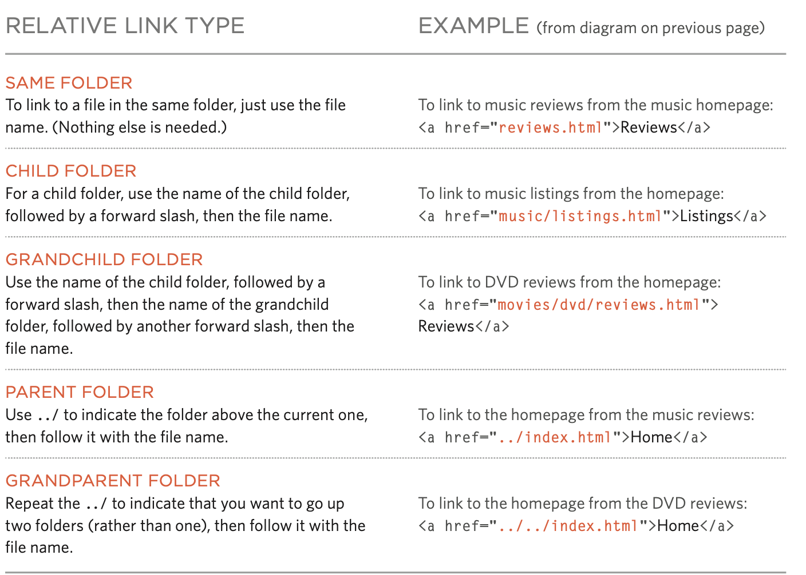

# welcome
## Links:


Links are the defining feature of the web because they allow you to move from one web page to another — enabling the very idea of browsing or surfing.

Links from one website to another

● Links from one page to another on the same website

● Links from one part of a web page to another   part of the same page

● Links that open in a new browser window

## Writing Links:

```
Links are created using the <a> element. Users can click on anything between the opening <a> tag and the closing </a> tag. You specify which page you want to link to using the href attribute.
```

# Linking to other sites:
```
<a>
```
```

Links are created using the <a> element which has an attribute called href. The value of the href attribute is the page that you want people to go to when they click on the link.
```

```
Users can click on anything that appears between the opening <a> tag and the closing </a> tag and will be taken to the page specified in the href attribute.
```

# Directory structure:

On larger websites it's a good idea to organize your code by placing the pages for each different section of the site into a new folder. Folders on a website are sometimes referred to as directories.

# relative urls:

Relative URLs can be used when linking to pages within your own website. They provide a shorthand way of telling the browser where to find your files.


## Linking to a speciFic part of the sfme page?

At the top of a long page
you might want to add a list
of contents that links to the corresponding sections lower down. Or you might want to add a link from part way down the page back to the top of it to save users from having to scroll back to the top.
```
Before you can link to a specific part of a page, you need to identify the points in the page that the link will go to. You do this using the id attribute (which can be used on every HTML element). You can see that the <h1> and <h2> elements in this example have been given id attributes that identify those sections of the page.
```
```
HTML Layout Elements
< header> - Defines a header for a document or a section
< nav> - Defines a set of navigation links
< section> - Defines a section in a document
< article> - Defines an independent, self-contained content
< aside> - Defines content aside from the content (like a sidebar)
< footer> - Defines a footer for a document or a section
< details> - Defines additional details that the user can open and close on demand
< summary> - Defines a heading for the
```

CSS Flexbox Layout:

Use of flexbox ensures that elements behave predictably when the page layout must accommodate different screen sizes and different display devices.

The position Property The position property specifies the type of positioning method used for an element.

# Position:

position: absolute

position: relative 

position: fixed

z-index

# JavaScript Functions:

* JavaScript Function Syntax A JavaScript function is defined with the function keyword, followed by a name, followed by parentheses ().
Function names can contain letters, digits, underscores, and dollar signs (same rules as variables).
The parentheses may include parameter names separated by commas: (parameter1, parameter2, …)
The code to be executed, by the function, is placed inside curly brackets: {}
* JavaScript Function Syntax A JavaScript function is defined with the function keyword, followed by a name, followed by parentheses ().
Function names can contain letters, digits, underscores, and dollar signs (same rules as variables).
The parentheses may include parameter names separated by commas: (parameter1, parameter2, …)
The code to be executed, by the function, is placed inside curly brackets: {}

# Declaring a function:

To create a function you give it a name and then write the statements needed to be done inside the curly braces.


# ANONYMOUS FUNCTIONS & FUNCTION EXPRESSIONS

* FUNCTION DECLARATION A function declaration creates a function that you can ca ll later in your code. It is the type of function you have seen so far in this book. In order to call the function later in your code, you must give it a name, so these are known as named functions. Below, a function called area() is declared, which can then be called using its name.

* FUNCTION EXPRESSION If you put a function where the interpreter would expect to see an expression, then it is treated as an expression, and it is known as a function expression. In function expressions, the name is usually omitted. A function with no name is called an anonymous function. Below, the function is stored in a variable called area. It can be called like any function created with a function declaration.


# IMMEDIATELY INVOKED FUNCTION EXPRESSIONS:

IMMEDIATELY INVOKED FUNCTION EXPRESSIONS (llFE) Pronounced “iffy,” these functions are not given a name. Instead, they are executed once as the interpreter comes across them.

Below, the variable called area will hold the value returned from the function (rather than storing the function itself so that it can be called later).


## VARIABLE SCOPE:

1. LOCAL VARIABLES When a variable is created inside a function using the var keyword, it can only be used in that function. It is called a local variable or function-level variable. It is said to have local scope or function-level scope. It cannot be accessed outside of the function in which it was declared. Below, area is a local variable.

1. GLOBAL VARIABLES If you create a variable outside of a function, then it can be used anywhere within the script. It is called a global variable and has global scope. In the example shown, wa 11 Size is a global variable.


# HOW MEMORY &VARIABLES WORK:
Global variables use more memory. The browser has to remember them for as long as the web page using them is loaded. Local variables are only remembered during the period of time that a function is being executed.