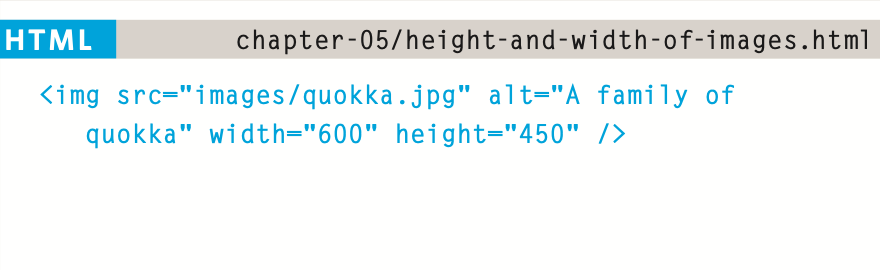

# welcome:
## Choosing images for Your site:

A picture can say a thousand words, and great images help make the difference between an average-looking site and a really engaging one.

## storing Images on Your site:

If you are building a site from scratch, it is good practice to create a folder for all of the images the site uses.

As a website grows, keeping images in a separate folder helps you understand how the site is organized. Here you can see an example of the files for a website; all of the images are stored in a folder called images.

On a big site you might like to add subfolders inside the images folder. For example, images such as logos and buttons might sit in a folder called interface, product photographs might sit in a page called products, and images related to news might live in a folder called news.

# adding Images:

```

```
```
To add an image into the page you need to use an  element. This is an empty element (which means there is no closing tag). It must carry the following two attributes:
```
```
src
```
This tells the browser where
it can find the image file. This will usually be a relative URL pointing to an image on your own site. (Here you can see that the images are in a child folder called images — relative URLs
```
alt
```
This provides a text description of the image which describes the image if you cannot see it.

```
title
```
```
You can also use the title attribute with the  element to provide additional information about the image. Most browsers will display the content of this attribute in a tootip when the user hovers over the image.
```

# height & width of Images:




## Where to place Images In Your Code:

1. before a paragraph.
1. InsIde the start of a paragraph.
1. In the mIddle of a paragraph.


## aligning Images horizontally:

align:
The align attribute was commonly used to indicate how the other parts of a page should flow around an image. It has been removed from HTML5
and new websites should use CSS to control the alignment of images.


### The align attribute can take these horizontal values:

* left
* right
* top
* middle
* bottom

# three rules for CreatIng Images:

1. save Images In the rIght format
1. saVe Images at the rIght size
1. use the CorreCt resolutIon


 Image formats:
* Jpeg
*  gIf
* png

# CroppIng Images:

When cropping images it is important not to lose valuable information. It is best to source images that are the correct shape if possible.

* portraIt
* landsCape


animated gifs:

Animated GIFs show several frames of an image in sequence and therefore can be used to create simple animations.


## figure & figure Caption:

```
<figure>
```
```
<figcaption>
```
