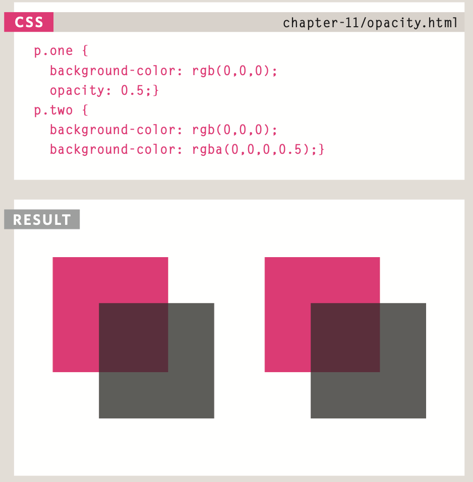

# welcome:
## Choosing images for Your site:

A picture can say a thousand words, and great images help make the difference between an average-looking site and a really engaging one.

## storing Images on Your site:

If you are building a site from scratch, it is good practice to create a folder for all of the images the site uses.

As a website grows, keeping images in a separate folder helps you understand how the site is organized. Here you can see an example of the files for a website; all of the images are stored in a folder called images.

On a big site you might like to add subfolders inside the images folder. For example, images such as logos and buttons might sit in a folder called interface, product photographs might sit in a page called products, and images related to news might live in a folder called news.

# adding Images:

```

```
```
To add an image into the page you need to use an  element. This is an empty element (which means there is no closing tag). It must carry the following two attributes:
```
```
src
```
This tells the browser where
it can find the image file. This will usually be a relative URL pointing to an image on your own site. (Here you can see that the images are in a child folder called images — relative URLs
```
alt
```
This provides a text description of the image which describes the image if you cannot see it.

```
title
```
```
You can also use the title attribute with the  element to provide additional information about the image. Most browsers will display the content of this attribute in a tootip when the user hovers over the image.
```

# height & width of Images:


## Where to place Images In Your Code:

1. before a paragraph.
1. InsIde the start of a paragraph.
1. In the mIddle of a paragraph.


## aligning Images horizontally:

align:
The align attribute was commonly used to indicate how the other parts of a page should flow around an image. It has been removed from HTML5
and new websites should use CSS to control the alignment of images.


### The align attribute can take these horizontal values:

* left
* right
* top
* middle
* bottom

# three rules for CreatIng Images:

1. save Images In the rIght format
1. saVe Images at the rIght size
1. use the CorreCt resolutIon


 Image formats:
* Jpeg
*  gIf
* png

# CroppIng Images:

When cropping images it is important not to lose valuable information. It is best to source images that are the correct shape if possible.

* portraIt
* landsCape


animated gifs:

Animated GIFs show several frames of an image in sequence and therefore can be used to create simple animations.


## figure & figure Caption:

```
<figure>
```
```
<figcaption>
```

# Foreground Color:

## color:

The color property allows you to specify the color of text inside an element. You can specify any color in CSS in one of three ways:
1. rgb values.
1. hex Codes.
1. Color names.

/* color name */

h1 {
  color: DarkCyan;}

/* hex code */

h2 {color: #ee3e80;}

/* rgb value */

p{color: rgb(100,100,90);}

# background Colre:

body {
  background-color: rgb(200,200,200);}

h1 {
  background-color: DarkCyan;}

h2 {
  background-color: #ee3e80;}

p{
background-color: white;}


*CSS treats each HTML element as if it appears in a box, and the background-color property sets the color of the background for that box.*

*You can specify your choice of background color in the same three ways you can specify foreground colors: RGB values, hex codes, and color names (covered on the next page).*


 # understanding Color:

 Every color on a computer screen is created by mixing amounts of red, green, and blue. To find the color you want, you can use a color picker.
 
 1. RGB 
 1. HEX
 1. ColoR Names
 1. Hue
 1. satuRatioN
 1. BRiGHtNess

 # Contrast:
 * low
 * high
 * medium

## Css3: opacity:



## hsl & hsla:
The hsl color property has
been introduced in CSS3 as an alternative way to specify colors. The value of the property starts with the letters hsl, followed
by individual values inside parentheses for:
1. hue
1. saturation
1. lightness
1. alpha


understarntdicinlge font formats:

Different browsers support different formats for fonts
(in the same way that they support different audio and video formats), so you will need to supply the font in several variations to reach all browsers.

bold:

font-weight:
1. normal

This causes text to appear at a normal weight.

1. bold

This causes text to appear bold.

1. In this example, you can see that the element whose class attribute has a value of credits has been bolded.

itaicllice:

font-style:

If you want to create italic text, you can use the font-style property. There are three values this property can take:

1. normal.

1. bold.

1. oblique.

uppercaSe &
loWercase:
* uppercase
* lowercase
* capitalize

letter & Word Sapratcicinlge:

Kerning is the term typographers use for the space between each letter. You can control the space between each letter with the letter-spacing property.
It is particularly helpful to increase the kerning when your heading or sentence is all in uppercase. If your text is in sentence (or normal) case, increasing or decreasing the kerning can make it harder to read.


## alignment:

* left
* right
* center
* justify
