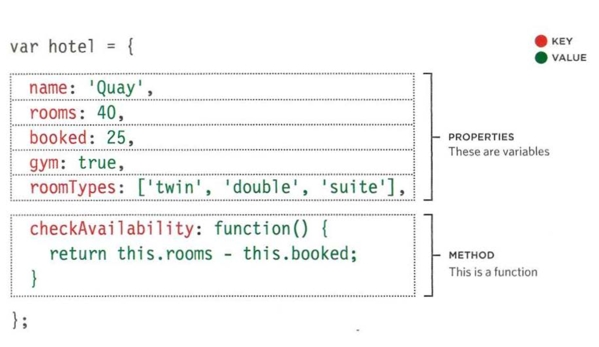
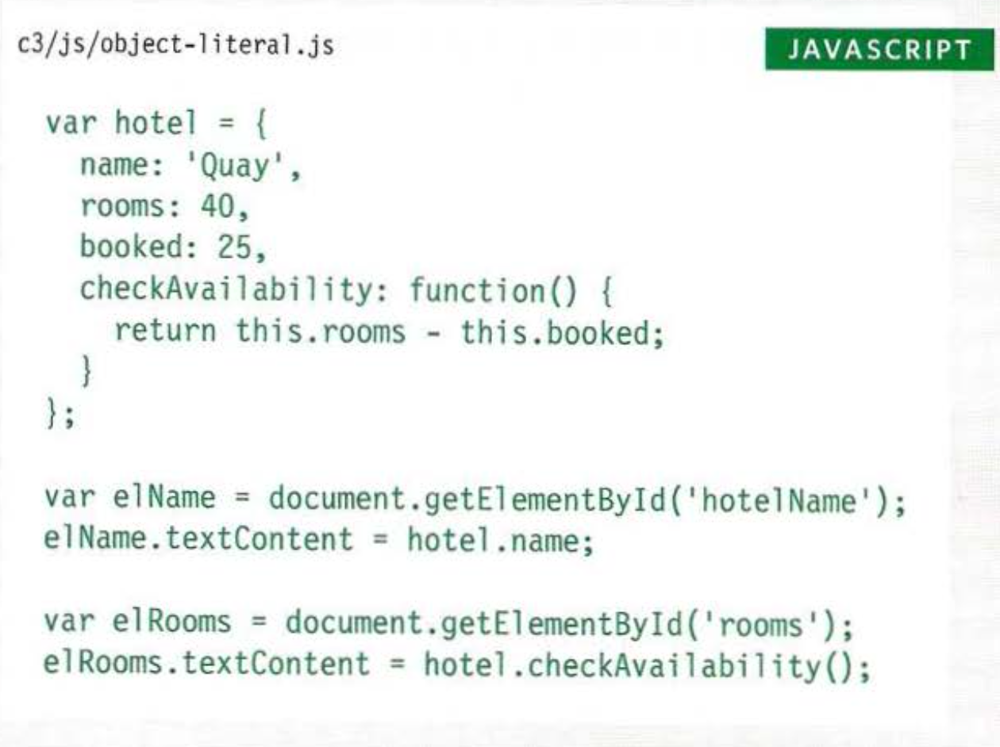
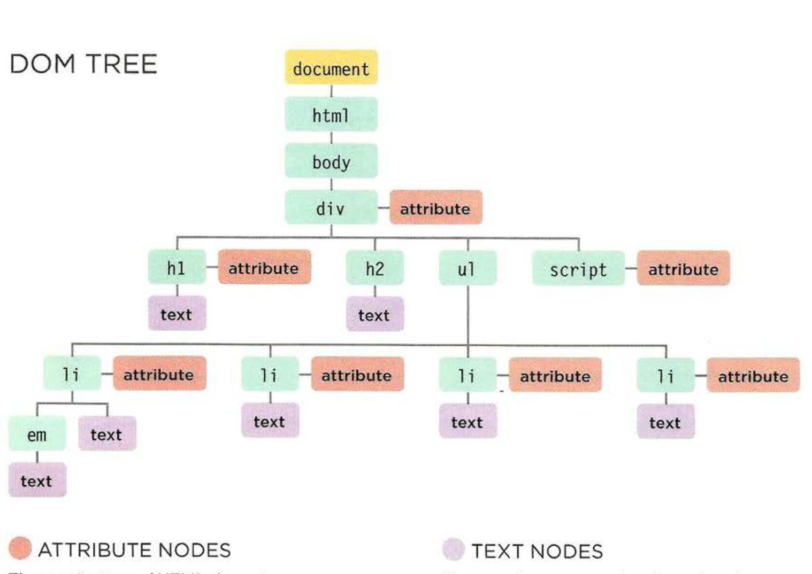
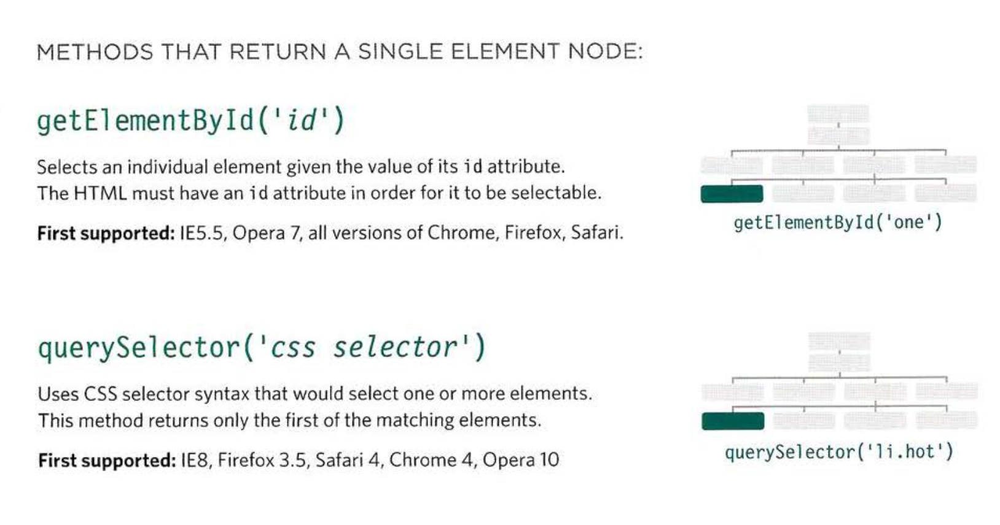
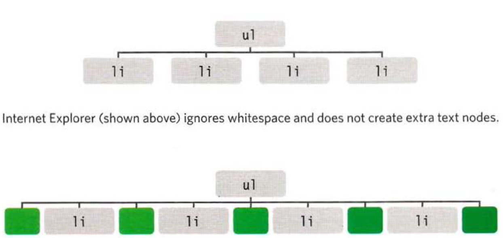
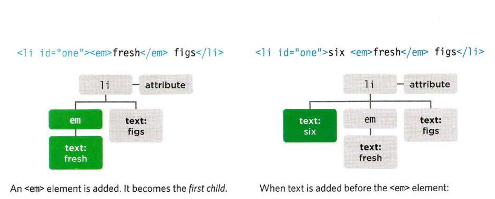
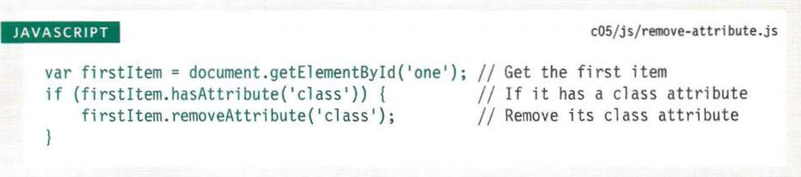

# welcome:

 ## WHAT IS AN OBJECT?

Objects group together a set of variables and functions to create a model of a something you would recognize from the real world. In an object, variables and functions take on new names.


###  This object represents a hotel. It has five properties and one method. The object is in curly braces. It is stored in a variable called hotel .




###  CREATING OBJECTS USING LITERAL NOTATION:

 CREATING OBJECTS USING LITERAL NOTATION
This example starts by creating an object using literal notation.

This object is called hotel which represents a hotel called Quay with 40 rooms (25 of which have been booked).

Next, the content of the page
is updated with data from this object.

 It shows the name of the hotel by accessing the object's name property and the number of vacant rooms using the checkAvailability() method.

To access a property of this object, the object name is followed by a dot (the period symbol) and the name of the property that you want.




# Document Object Model:

 The Document Object Model (DOM) specifies
how browsers should create a model of an HTML
page and how JavaScript can access and update the contents of a web page while it is in the browser window.

 THE DOM TREE IS A MODEL OF A WEB PAGE:



 ACCESSING ELEMENTS:

 DOM queries may return one element, or they may return a Nodelist, which is a collection of nodes.

 

SELECTING ELEMENTS USING ID ATTRIBUTES:

get elementby id() allows you to select a single element node by specifying the value of its id attribute.
* getElementsByTagNam.
* getElementsByClassName
* querySelectorA11

 TRAVERSING THE DOM:

 When you have an element node, you can select another element in relation to it using these five properties. This is known as traversing the DOM.

 1. parentNode.
 1. previousSibling nextSibling.
 1. firs Child last Child.

 WHITESPACE NODES:
 
 Traversing the DOM can be difficult because some browsers add a text node whenever they come across whitespace between elements.

  

FlRST & LAST CHILD:
```
 These properties also return inconsistent results if there is whitespace between elements. Inthis example, a slightly different solution is used in the HTML - the closing tags are put
next to the opening tags of the next element, making it a little more readable. The example starts by using the getElementsByTagName() method to select the <ul>
element from the page. From this element node, the fi rstChi 1d property will return the first <1i > element, and the 1astChi 1d property will return the last <l i > element.
```

 HOW TO GET/UPDATE ELEMENT CONTENT:

 So far this chapter has focused on finding elements in the DOM tree. The rest of this chapter shows how to access/update element content. Your choice of techniques depends upon what the element contains.

  

 ACCESS & UPDATE A TEXT NODE WITH NODEVALUE:

When you select a text node, you can retrieve or amend the content of it using the nodeVa1ue property.

document.getElementByid( 1 one 1 ).firstChild.nextSibling. nodeValue ;

 ACCESSING &CHANGING A TEXT NODE:

 To work with text in an element, first the element node is accessed and then its text node.

 The text node has a property called nodeValue which returns the text in that text node.

 You can also use the nodeVa1ue property to update the content of a text node.

 #  ACCESS & UPDATE TEXT WITH TEXTCONTENT:


The textContent property allows you to collect or update just the text that is in the containing element (and its children).

1. textContent
1. innerText

## UPDATE TEXT & MARKUP:

This example starts by storing the first list item in a variable called fi rstltem.

It then retrieves the content of this list item and stores it in a variable called i temContent.

Finally, the content of the list item is placed inside a link. Note how the quotes are escaped.

ADDING ELEMENTS USING DOM MANIPULATION:

DOM manipulation offers another technique to add new content to a page (rather than
i nnerHTML). It involves three steps:

1. CREATE THE ELEMENT -- createEl ement ().
1. GIVE IT CONTENT -- createTextNode().
1. ADD IT TO THE DOM -- appendChild().


DEFENDING AGAINST CROSS-SITE SCRIPTING:

VALIDATE INPUT GOING TO THE SERVER.
* Only let visitors input the kind of characters they need to when supplying information. This is known as validation. Do not allow untrusted users to submit HTML markup or JavaScript.

*  Double-check validation on the server before displaying user content/storing it in a database. This is important because users could bypass validation in the browser by turning JavaScript off.
*  The database may safely contain markup and script
from trusted sources (e.g., your content management system). This is because it does not try to process the code; it just stores it.


#  REMOVING ATTRIBUTES:

  


 EXAMINING THE DOM IN CHROME:

 Modern browsers come with tools that help you inspect the page loaded in the browser
and understand the structure of the DOM tree.


EXAMINING THE DOM IN FIREFOX:

Firefox has similar built-in tools, but you can also download a DOM inspector tool that shows the text nodes.