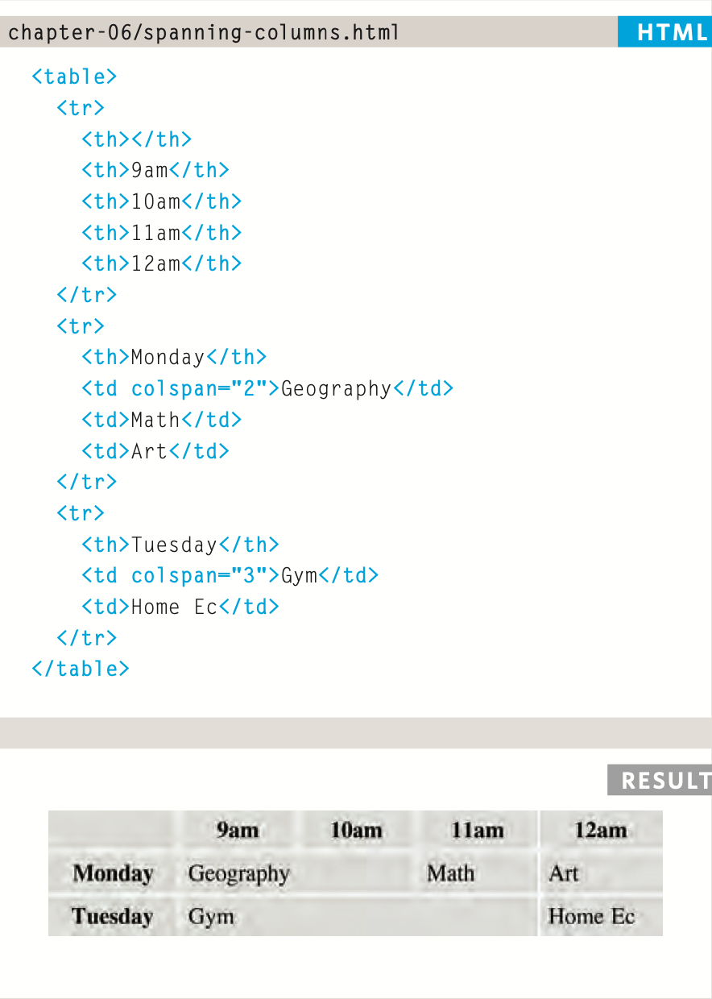
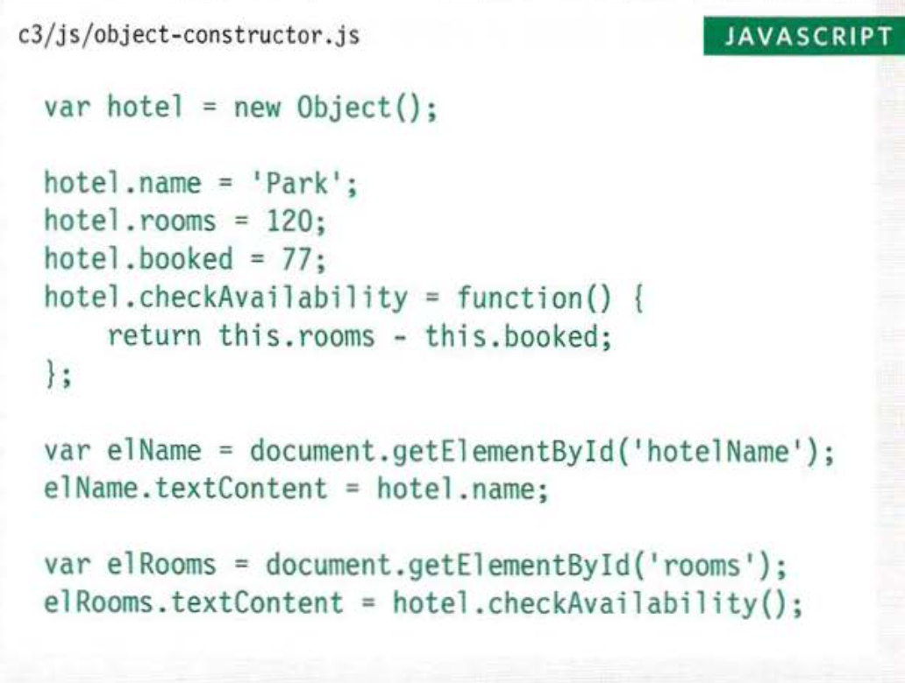
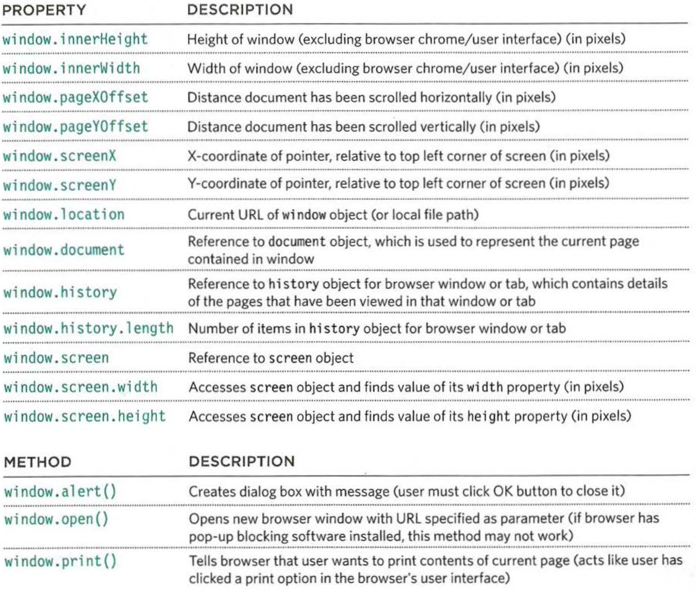
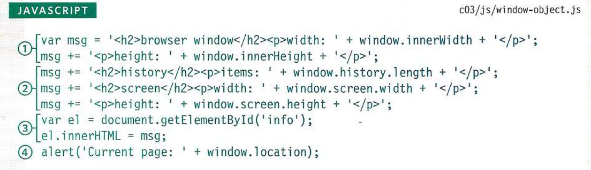

# welcome:

## What's atable?:

A table represents information in a grid format. Examples of tables include financial reports, TV schedules, and sports results.


## basic table structure:

```
<table>

The <table> element is used to create a table. The contents of the table are written out row by row.

<tr>

You indicate the start of each row using the opening <tr> tag. (The tr stands for table row.)
It is followed by one or more <td> elements (one for each cell in that row).
At the end of the row you use a closing </tr> tag.

<td>

Each cell of a table is represented using a <td> element. (The td stands for table data.)

```


## Table hearding:

```
<th>
```
The <th> element is used just like the <td> element but its purpose is to represent the heading for either a column or a row.

# spanning columns:

Sometimes you may need the entries in a table to stretch across more than one column.
```
The colspan attribute can be used on a <th> or <td> element and indicates how many columns that cell should run across.
```



# long Tables:
```
These elements help people who use screen readers and also allow you to style these sections in a different manner than the rest of the table (as you will see when you learn about CSS).


<thead>

The headings of the table should sit inside the <thead> element.

<tbody>

The body should sit inside the <tbody> element.

<tfoot>

The footer belongs inside the <tfoot> element.
By default, browsers rarely treat the content of these elements any differently than other elements however designers often use CSS styles to change their appearance.

```

 # CREATING OBJECTS USING CONSTRUCTOR SYNTAX:




 CREATE & ACCESS OBJECTS CONSTRUCTOR NOTATION:


To get a better idea of why you might want to create multiple objects on the same page, here is an example t hat shows room availability in two hotels.
First, a constructor function defines a template for the hotels. Next, two different instances
of this type of hotel object are created. The first represents
a hotel called Quay and t he second a hotel called Park.
Having created instances of these objects, you can then access their properties and methods using the same dot notation that you use with all other objects.


#  ADDING AND REMOVING PROPERTIES:

You do this using the dot notation that you saw for adding

To delete a property, you us


##  THE BROWSER OBJECT MODEL:THE WINDOW OBJECT:

The window object represents the current browser window or tab. It is the topmost object in the Browser Object Model, and it contains other objects that tell you about the browser.



USING THE BROWSER OBJECT MODEL:

* Two of the window object's
properties, i nnerWi dth and
i nnerHei ght, show width and height of the browser window

* Child objects are stored as properties of t heir parent object. So dot notation is used to access them, just like you would access any other property of that object.

* The element whose id attribute has a value of info is selected, and the message that has been built up to this point is written into the page.



