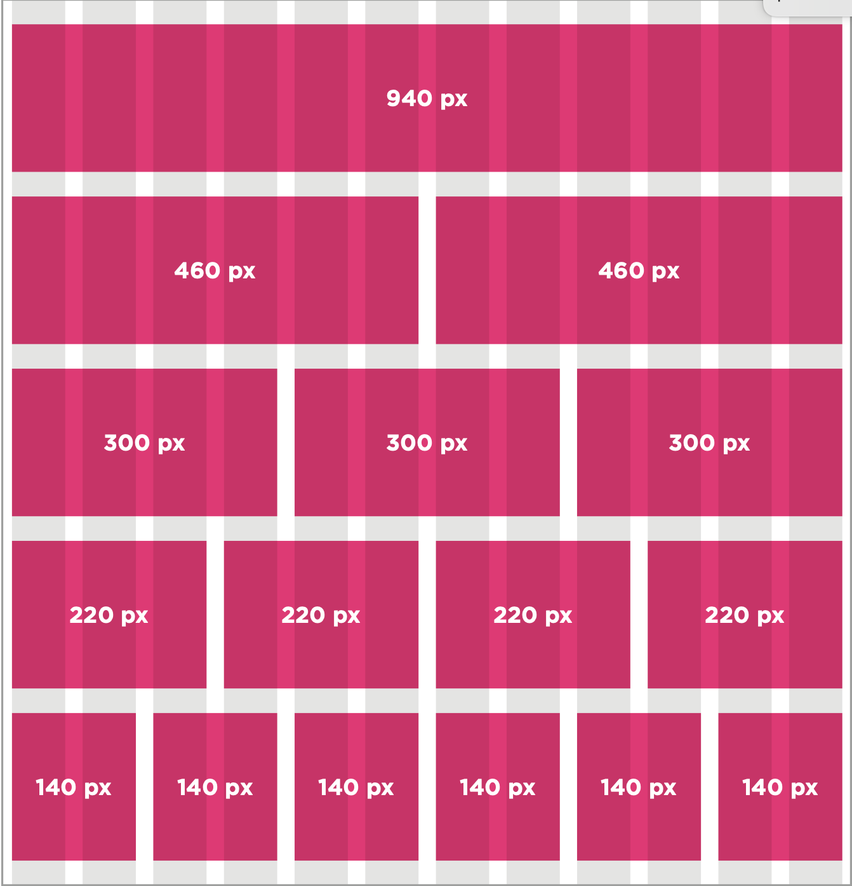

# welcome

# Key Concepts in positioning elements:

CSS treats each HTML element as if it is in its own box. This box will either be a block-level box or an inline box.


containing ElEmEnts:
```
If one block-level element sits inside another block-level element then the outer box is known as the containing or parent element.

It is common to group a number of elements together inside a <div> (or other block-level) element. For example, you might group together all of the elements that form the header of a site (such as the logo and the main navigation). The <div> element that contains this group of elements is then referred to as the containing element.
```


```
The orange lines in this diagram represent <div> elements. The header (containing the logo and navigation) are in one <div> element, the main content of the page is in another, and the footer is in a third. The <body> element is the containing element for these three <div> elements. The second <div> element is the containing element for two paragraphs of Latin text and images (represented by crossed squares).
```

A box may be nested inside several other block-level elements. The containing element is always the direct parent of that element.

## floating elements:

float:

The float property allows you to take an element in normal flow and place it as far to the left or right of the containing element as possible.

Anything else that sits inside the containing element will flow around the element that is floated.

When you use the float property, you should also use the width property to indicate how wide the floated element should be. If you do not, results can be inconsistent but the box is likely to take up the full width of the containing element (just like it would in normal flow).
```
In this example, a <blockquote> element is used to hold a quotation. It's containing element is the <body> element.

```
```
The <blockquote> element
is floated to the right, and the paragraphs that follow the quote flow around the floated element.
```


## Clearing floats:

* left

The left-hand side of the box should not touch any other elements appearing in the same containing element.
* right

The right-hand side of the
box will not touch elements appearing in the same containing element.
* both

Neither the left nor right-hand sides of the box will touch elements appearing in the same containing element.

* none

Elements can touch either side.

# screen sizes:

Different visitors to your site will have different sized screens that show different amounts of information, so your design needs to be able to work on a range of different sized screens.


# screen resolution:
Resolution refers to the number of dots a screen shows per inch. Some devices have a higher resolution than desktop computers and most operating systems allow users to adjust the resolution of their screens.

# page sizes:

Because screen sizes and display resolutions vary so much, web designers often try to create pages of around 960-1000 pixels wide (since most users will be able to see designs this wide on their screens).


## Layout grids:

Composition in any visual art (such as design, painting, or photography) is the placement or arrangement of visual elements — how they are organized on a page. Many designers use a grid structure to help them position items on a page, and the same is true for web designers.

On the right, you can see a set of thick vertical lines superimposed over the top of a newspaper website to show you how the page was designed according to a grid. This grid is called the 960 pixel grid and is widely used by web designers.

Grids set consistent proportions and spaces between items which helps to create a professional looking design.


# possibLe Layouts: 960 pixeL wide 120 Column grid:



# `Traditional HTML Layout:`

HTML5 introduces a new set of elements that allow you to divide up the parts of a page. The names of these elements indicate the kind of content you will find in them.

The layout in html5 and main thing in html is:

1. footer
1. strong
1. nav
1. main
1. artical
1. header

### in the picture ther is an explanation for that.


last thing we talked about in this sheets its **site maps:**

Now that you know what needs to appear on your site, you can start to organize the information into sections or pages.


## `Example site map:`


## `Example WireFrames:`


The color property allows you to specify the color of text inside an element. You can specify any color in CSS in one of three ways:
1. rgb values.
1. hex Codes.
1. Color names.

/* color name */

h1 {
  color: DarkCyan;}

/* hex code */

h2 {color: #ee3e80;}

/* rgb value */

p{color: rgb(100,100,90);}

# background Colre:

body {
  background-color: rgb(200,200,200);}

h1 {
  background-color: DarkCyan;}

h2 {
  background-color: #ee3e80;}

p{
background-color: white;}


*CSS treats each HTML element as if it appears in a box, and the background-color property sets the color of the background for that box.*

*You can specify your choice of background color in the same three ways you can specify foreground colors: RGB values, hex codes, and color names (covered on the next page).*


 # understanding Color:

 Every color on a computer screen is created by mixing amounts of red, green, and blue. To find the color you want, you can use a color picker.
 
 1. RGB 
 1. HEX
 1. ColoR Names
 1. Hue
 1. satuRatioN
 1. BRiGHtNess

 # Contrast:
 * low
 * high
 * medium

## Css3: opacity:


## hsl & hsla:
The hsl color property has
been introduced in CSS3 as an alternative way to specify colors. The value of the property starts with the letters hsl, followed
by individual values inside parentheses for:
1. hue
1. saturation
1. lightness
1. alpha


