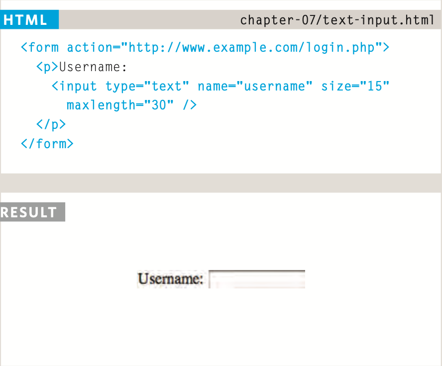
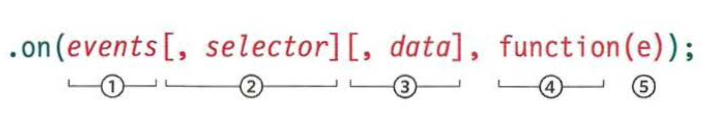
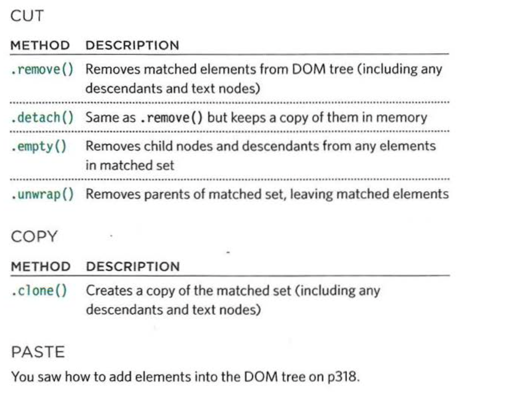

# welcome:
today we talked about forms.
## Why Forms?

The best known form on the web is probably the search box that sits right in the middle of Google's homepage.

# Form Controls:

There are several types of form controls that you can use to collect information from visitors to your site.
* Adding text:
* making choices:
* submitting Forms:
* uploading files:


text input:



password Input:
same thing put chage text to passord.

Table Properties

## width: 

to set the width of the table

## padding:

to set the space between the border of each table cell and its content

## text-transform

 to convert the content of the table headers to uppercase

## letter-spacing, font-size

 to add additional styling to the content of the table headers

## border-top, border-bottom

 to set borders above and below the table headers

## text-align

 to align the writing to the left of some table cells and to the right of the others

## background-color

 to change the background color of the alternating table rows

## hover

 to highlight a table row when a user’s mouse goes over it

# Border on Empty Cells(empty-cells)


show This shows the borders of any empty cells.

hide This hides the borders of any empty cells.

inherit If you have one table nested inside another, the inherit value instructs the table cells to obey the rules of the containing table.


# Events

Events are the browser’s way of indicating when something has happened (such as when a page has finished loading or a button has been clicked).

The load event is commonly used to trigger scripts that access the contents of the page.


 # ADDITIONAL PARAMETERS FOR EVENT HANDLERS:

 

 WORKING WITH FORMS
 The form lets users add a new item to the list with a single text input and a submit button.

 ##  CUTTING & COPYING ELEMENTS:
  


 BOX DIMENSIONS:

 These methods allow you to discover or update the width and height of all boxes on the page.

  WINDOW & PAGE DIMENSIONS:

  The •height() and •width() methods can be used to determine the dimensions of both the browser window and the HTML document. There are also methods to get and set the position of the scroll bars.

  POSITION OF ELEMENTS ON THE PAGE:

  The .offset() and .position() methods can be used to determine the position of elements on the page.

  # WHERE TO PLACE YOUR SCRIPTS:
```
  The position of <scri pt>elements can affect how quickly a web page seems to load.
```
```
SPEED
In the early days of the web, developers were told to place the <script> tags in the <head> of the page as you do with style sheets. However, this can make pages seem slower to load.


Your web page may use files from several different locations (e.g., images or CSS files might be loaded from one CDN, jQuery could be loaded from the jQuery or Google CDNs, and fonts might be loaded from another third party).


Usually a browser will collect up to two files at a time from each different server. However, when a browser starts to download a JavaScript file, it stops all other downloads and pauses laying out the page until the script has finished loading and been processed.


Therefore, if you place the script at the end of the page before the closing </body> tag, it will not affect the rendering of the rest of the page.
```

 EXTENDING JQUERY WITH PLUGINS:

 Plugins are scripts that extend the functionality of the jQuery library. Hundreds have been written and are available for you to use.

 Plugins offer functionality that is not included
in the jQuery library. They usually deal with a particular task such as creating slideshows or video players, performing animations, transforming data, enhancing forms, and displaying new data from a remote server.
To get an idea of the number and range of plugins available, see http://plugins .jquery.com.
All of these are free for you to download and use on your own sites. You may also find other sites listing jQuery plugins for sale (such as codecanyon. net).

HOW TO CHOOSE A PLUGIN
When you are choosing a plugin to work with, it can be worth checking that it is still being maintained or whether other people have experienced problems using it. Finding out the following can help:
