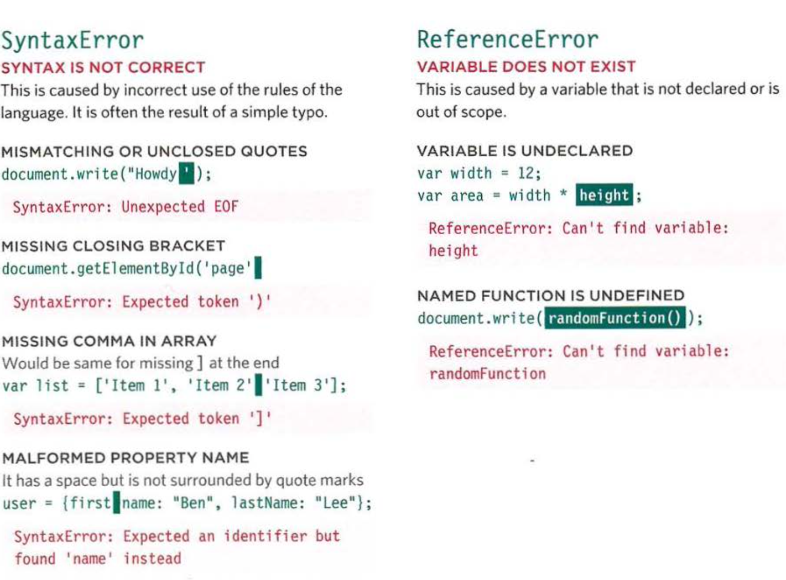
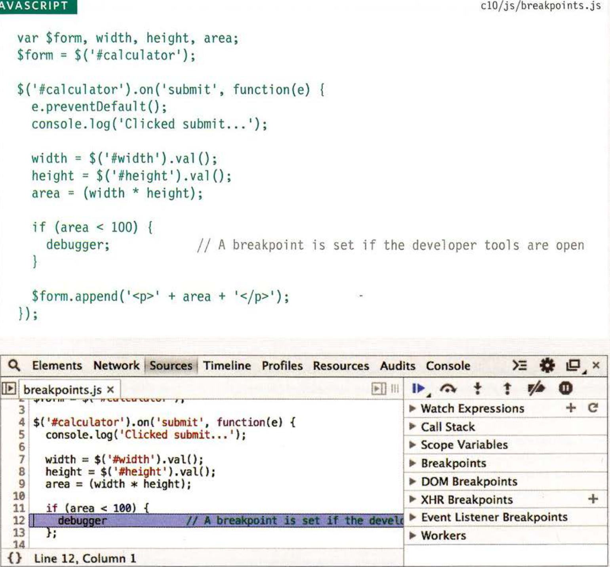

# welcome:

today we talked about error and Debugging:

To find the source of an error, it helps to know how scripts are processed. The order in which statements are executed can be complex; some tasks cannot complete until another statement or function has been run

#  EXECUTION CONTEXTS:

The JavaScript interpreter uses the concept of execution contexts. There is one global execution context; plus, each function creates a new new execution context. They correspond to variable scope.

 EXECUTION CONTEXT & HOISTING:

 1. PREPARE:

* The new scope is created
* Variables, functions, and arguments are created
* The value of the this keyword is determined

1. EXECUTE:

* Now it can assign values to variables.
* Reference functions and run their code .
* Execute statements.

###  UNDERSTANDING SCOPE:

In the interpreter, each execution context has its own vari ables object. It holds the variables, functions, and parameters available within it. Each execution context can also access its parent's vari ables object.

#  UNDERSTANDING ERRORS:

If a JavaScript statement generates an error, then it throws an exception . At that point, the interpreter stops and looks for exception-handling code.

If you are anticipating that something in your code may cause an error, you can use a set of statements to handle the error 

This is important because if the error is not handled, the script will just stop processing and the user will not know why. So exception-handling code should inform users when there is a problem.

#  ERROR OBJECTS CONTINUED:

#  HOW TO DEAL WITH ERRORS:

Now that you know what an error is and how the browser treats them, there are two things you can do with the errors.

1. DEBUG THE SCRIPT TO FIX ERRORS

If you come across an error while writing a script (or when someone reports a bug), you will need to debug the code, track down the source of the error, and fix it.

1. HANDLE ERRORS GRACEFULLY:

You can handle errors gracefully using try, catch,
throw, and f i na1ly statements.
Sometimes, an error may occur in the script for a reason beyond your control. For example, you might request data from a third party, and their server may not respond. In such cases, it is particularly important to write error-handling code.

## DEBUGGER KEYWORD:

 You can create a breakpoint in your code using just the debugger keyword. When the developer tools are open, this will automatically create a breakpoint.

 You can also place the debugger keyword within a conditional statement so that it only triggers the breakpoint if the condition is met. This is demonstrated in the code below.

 it is particularly important to remember to remove these statements before your code goes live as this could stop the page running if a user has developer tools open.

 
