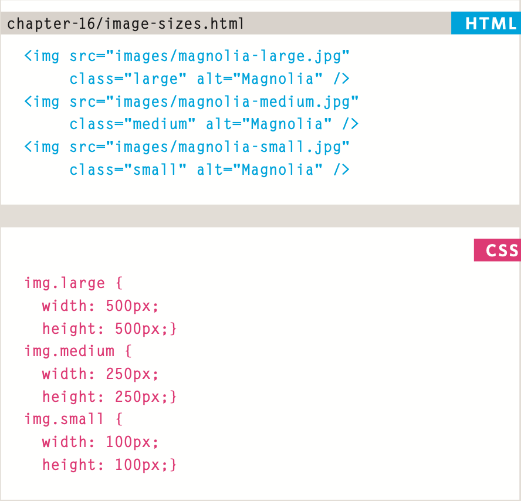
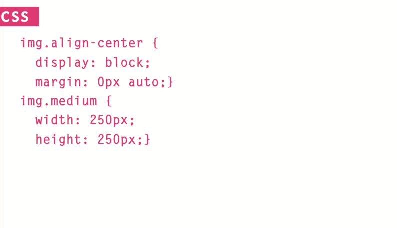

# welcome

## controlling size of images in css:

You can control the size of an image using the width and height properties in CSS, just like you can for any other box.
Specifying image sizes helps pages to load more smoothly because the HTML and CSS code will often load before the images, and telling the browser how much space to leave for an image allows it to render the rest of the page without waiting for the image to download.
You might think that your site
is likely to have images of all different sizes, but a lot of sites use the same sized image across many of their pages.

aligning images using css:

1. float: left;
1. float: right;

centering Imges using css:

By default, images are inline elements. This means that they flow within the surrounding text. In order to center an image, it should be turned into a block- level element using the display property with a value of block.
Once it has been made into a block-level element, there are two common ways in which you can horizontally center an image:

* On the containing element, you can use the text-align property with a value of center.

* On the image itself, you can use the use the margin property and set the values of the left and right margins to auto.

